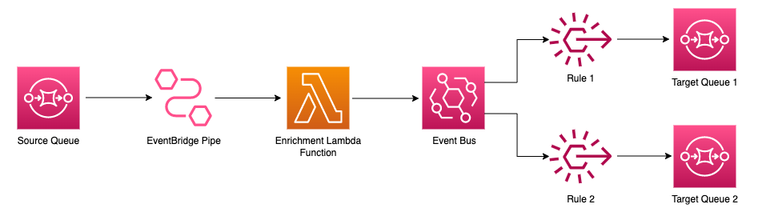

# Split SQS messages to multiple queues with original payload using EventBride and Pipes

This repository contains the source code of the project which demonstrate how messages of SQS queue can be split into multiple SQS queues based on the message contents using EventBridge Pipes, Event Bus and Rules.

More details about the project and deployment instructions can be found in this article:
[Article URL](https://dev.to/pubudusj)

## Architecture

